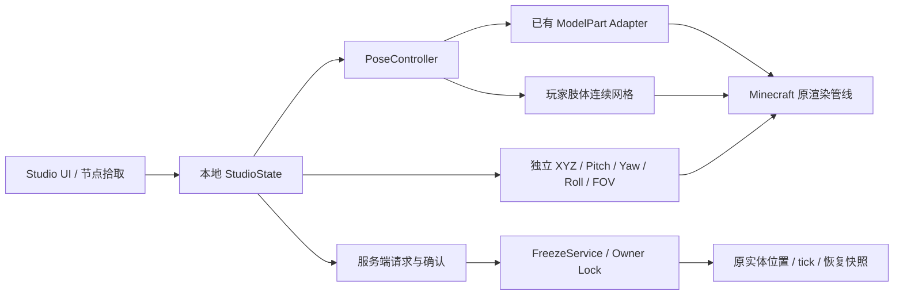

# 实现方案与接口检查

目标版本为 Java 17 / Minecraft Java 1.20.1 / Forge 47.4.10，采用 Mojang 官方 1.20.1 映射。初始目录为空，从独立 ForgeGradle 6.0.54 工程建立，不依赖其他 Mod 项目的业务代码。

## 已检查的实际接口

通过本机对应版本映射 JAR 的 `javap` 检查字段、方法及关键渲染调用顺序，主要结论如下。

| 接口 | 实际行为与实现选择 |
|---|---|
| `ModelPart` | 位置/旋转公开，children/cubes 私有；用 Mixin Accessor 读取，保留原 children 层级。 |
| `LivingEntityRenderer.render` | 每帧执行 prepareMobModel / setupAnim 后再 renderToBuffer；不能只在 UI 操作时设置 ModelPart。 |
| `EntityRenderDispatcher.render` | 为当前实体建立短暂 RenderContext，隔离同一 renderer 下的不同实体。 |
| `ModelPart.render` | 绘制前应用静态数值、绘制后恢复。每次渲染都覆盖原始动画生成的旋转；不会将共享模型永久改写。 |
| `ModelPart.translateAndRotate` | 对头饰、手持物等直接使用部件变换的附加层也临时应用 Pose，调用完成后恢复。 |
| `ModelPart.compile` | 对玩家肢体替换 cube 的几何输出；其他部件与其他生物继续走原路径。 |
| `Camera.setup` | 相机碰撞/第三人称偏移已计算；尾部设置独立 XYZ、Yaw、Pitch 和 detached，最终位置不再受碰撞限制。 |
| `ViewportEvent.ComputeCameraAngles` | Forge 原生提供 Yaw/Pitch/Roll，用于相机角度。 |
| `ViewportEvent.ComputeFov` | 在游戏设置计算后的 raw FOV 事件中设置镜头参数。 |
| `RenderLevelStageEvent.AFTER_ENTITIES` | 保存实际视图/投影矩阵。模型节点保存模型到视图矩阵，投影与鼠标拾取采用同一组矩阵。 |
| `ServerLevel.tickNonPassenger` | 对被冻结的非玩家实体取消 tick，阻止实体自有 AI、移动及时间驱动状态继续变化。 |
| `ServerGamePacketListenerImpl` | 冻结玩家的移动、动作与交互数据在主线程处理入口拦截。网络线程不访问锁 Map。 |

参考 Forge 官方源码：[相机事件](https://raw.githubusercontent.com/MinecraftForge/MinecraftForge/1.20.x/src/main/java/net/minecraftforge/client/event/ViewportEvent.java)、[生物渲染事件](https://raw.githubusercontent.com/MinecraftForge/MinecraftForge/1.20.x/src/main/java/net/minecraftforge/client/event/RenderLivingEvent.java)、[Forge 1.20.1 下载](https://files.minecraftforge.net/net/minecraftforge/forge/index_1.20.1.html)。实际编译和运行使用固定的 47.4.10 本地接口，而非以最新文档代替编译验证。

## 数据与权限

客户端不自行宣布冻结成功。FreezeService 先检查操作者身份、同一维度、距离、骑乘状态和锁所有权，再创建快照，返回服务端实际 Actor Transform。多个操作者不能抢占同一实体。

变换数据检查有限数值、世界坐标和会话范围。退出、登出、维度切换、实体移除和服务器停止有清理路径。Pose 数据留在本地，用于摄影；网络只处理会影响世界的冻结和 Actor Transform。

## 玩家连续关节

四个新增关节独立于通用生物 Adapter。`left_arm` / `right_arm` 保留肩部变换，`left_leg` / `right_leg` 保留髋部变换；肘膝分别控制下半段。

`BendMath` 将肢体描述为上半段直线、关节连续旋转区、下半段直线。关节中心位于手臂局部 Y=4、腿局部 Y=6，旋转区宽 4 模型像素。沿长度积分旋转后的切线获得连续中心线；横截面随该位置的旋转变换。

每个原始 cube 的侧面细分为 32 条带，读取真实 baked polygon 顶点和 UV 后做连续变换。相邻条带使用相同边界顶点和相同映射。90° 单轴旋转时中心线呈圆弧，不是将两个独立方块拼接。零角度保留原版渲染，外轮廓和皮肤 UV 不变。皮肤外层与常规 humanoid 盔甲可复用相同弯曲过程；头部帽层、袖子、裤腿和外套使用对应基础部件的 Pose。

v0.1.3 显式注册玩家的外层别名，六个外层不创建独立编辑骨骼。Skin Layers 3D 的 CustomizableModelPart.compile 通过可选 @Pseudo Mixin 包装 VertexConsumer；该路径不依赖第三方类链接，也不覆盖该模组的 MeshTransformerProvider。每个渲染帧记录当前 ModelPart 在 translateAndRotate 之后、第三方体素偏移之前的矩阵，主画面和阴影分别记录。包装器将已变换的顶点逆变换回这个共享肢体空间，按同一 BendMath 连续变形后再返回原空间，保留颜色、UV、光照和 overlay。面沿纵向按像素跨度细分，最大 32 段。第三方缓存几何不被修改，零关节旋转或缺少匹配部件时直接使用原 consumer。

Skin Layers 3D 桥接匹配明确的方法签名，require=0；不同版本若不再提供该签名，不使游戏启动失败，但其独立网格也不会获得本桥接的肘膝变形。当前支持证据限定实际安装的 1.11.2。其他仍经 ModelPart.compile 的皮肤层继续使用通用路径。

StudioScreen 的中央视口独立分派相机手势。节点/Gizmo 优先于左键转动摄影机，右键平移和中键/FOV 缩放不写 ActorTransform 或 BonePose。属性框与侧栏不参与相机手势。数值输入保持原有明确应用流程。

v0.1.4：EntityModelAdapter.limbRoots 按真实 ModelPart 身份记录子节点所属肢体；wrapDescendant 把子节点已变换的顶点还原到肢体空间，使用相同 BendMath。EMFModelPart 覆盖了 compile，需可选 EmfMeshMixin 单独接入；原 compile 实现、UV、纹理选择和渲染类型继续保留。EmfAnimationMixin 仅取消当前冻结 actor 的 EMFModelPartRoot.animate，不改全局配置。

ActorState.boneScales 保存每个姿势键第一次使用的缩放，所有皮肤别名共用这个快照，ModelPart 每次渲染后仍恢复原字段。skinBases 用于实际比较底层/外层的矩阵；meshSignatures 对提交的变形顶点作数值摘要，用于确认 UI 调整确实改变和撤回了可见几何。

StudioUndo 只保存一个恢复回调。数值应用与 Pose Load 保存调整前快照；Gizmo 或摄影机拖动在首次有效变化时提交快照，后续事件不重写。解除冻结与退出时清除历史。旋转环默认只显示当前轴，侧向视图下射线几乎平行于旋转平面时使用屏幕拖动增量，避免点击后无变化。

肘膝默认允许三个 Euler 轴自由旋转。没有 IK、时间插值或关节约束；弯曲区内的空间旋转变化用于静态几何生成，不是动画插值。

## 适配与降级

优先使用 Humanoid / Quadruped 的稳定名称、HierarchicalModel.root 及 children 名称。其他可读取模型仅反射 ModelPart 字段。只遍历已知容器，不扫描整个实体对象图，不对未知模型库注入新骨骼。

Adapter 可复用共享 renderer 的结构，但 Pose 和骨骼数值按 Actor UUID 独立保存。每次 ModelPart 绘制使用栈保存并恢复自身数值。没有可访问部件时显示说明，Actor 与相机仍可用。

生产构建生成 refmap 和 Shadow 的额外 SRG 映射；`reobfJar` 使用两者。发行 JAR 已用普通 Forge 启动入口验证，避免只在开发环境的官方方法名下可运行。

## v0.1.5 临时场景对象

EntityCatalogScreen 从当前 BuiltInRegistries.ENTITY_TYPE 读取注册类型和实体自身译名，仅提供搜索、单对象选择、位置和朝向。StudioNetwork.PlaceRequest 单独传输类型与变换；网络协议升级到 2，客户端和服务器应使用同一版。

FreezeService.place 在服务端检查活动会话、操作者权限、有限数值、512 格距离、目标已加载区块和同维度共享的 StudioConfig.SERVER 预算（默认 8，范围 5–10，包含所有冻结对象）。实体由注册的 EntityType factory 创建，加入世界前建立原有冻结锁；PLACED 另行记录临时实体所有权。removePlaced 只允许移除操作者新添加的实体。客户端等待实际实体复制完成后才选中并显示冻结状态。

原实体的 release/end 继续恢复快照；临时实体则 discard。临时标记用于重新载入时清理崩溃残留。MobMixin 拦截 checkDespawn，因为 ServerLevel 会在 tickNonPassenger 之外调用它。PhysicsStudioMixin 是可选 @Pseudo 桥接，仅阻止冻结对象和刚移除临时对象的 blockifyEntity，不依赖 Physics Mod 类型链接。

Humanoid.hat 与 head 共用 head 姿势键；Fresh Animations skeleton.jem 的 head 无可见 cubes，headwear 包含实际头部。因此修改 head 需要同步其头部外层，而不是新建生物骨骼。EMF 内部节点仍被完整读取；默认 UI 隐藏内部节点，开启辅助可查看。

## v0.1.5 主画面批量入场与 Actor 多选

VisibleActors 在 AFTER_SKY / AFTER_ENTITIES 之间收集 Dispatcher 的实际世界实体提交，排除 shader shadow、非世界预览、不可见和 EntityCulling 的 culled 对象。主画面快照加入玩家本人。F6 在客户端先检查数量并临时 pin，BatchRequest.enter 在服务端统一验证所有 UUID、权限、区块、骑乘、锁和预算，然后建立全部锁；失败不建立会话或部分锁。进入等待期间客户端冻结 tick 和姿势，确认后开放 UI；取消等待后迟到的成功回复会发送 END 清理。

网络协议为 3，客户端与服务器需同版。BatchRequest / BatchReply 携带最多 10 个 UUID 与 ActorTransform；入场与多选 MOVE 都使用服务器主线程事务。MOVE 批次先验证全部目标并保存原 transform，再应用；失败恢复本批原位置，玩家位移使用连接 teleport 同步。Pose 仍为本地摄影姿势。

StudioState.selection 保存多选集合，selected 为主对象；Pose 编辑继续只使用主对象的 bone。StudioOverlay 的 Actor 拖动将屏幕点反投影到选中模型中心的固定深度平面，在按下时记录整组原位置，用统一世界空间 delta 发给服务器。该路径只在 Actor 模式的模型命中上启用。空白视口、Pose Gizmo 和 Camera 手势分别保持原语义，切换模式或隐藏面板结束拖动。StudioUndo 保存整组快照，一个完整手势仅记一次。

EntityPlacementFactory 默认使用 EntityType.create；针对 LrTactical ThrowableItemEntity 通过可选反射调用 CommonAssetsManager 的资源索引、createItemStack 和原生 createEntity，匹配目标 EntityType 并设置同步 ItemStack。不建立内部骨骼，不改资源，不引入硬依赖；缺失 API / 资源时创建失败并提示。

非玩家默认节点由 adapter 提取可见几何的语义根和解剖节点，再由当前实际主 pass 的 ModelPart 矩阵过滤。这样未渲染的护甲 / 项圈层不能让空 head 误入默认列表。EMF 节点可读名称取自现有模型；完整路径仍作为 Pose 键，UI 简化叶节点名称，打开辅助可查看全部。

ClientEvents 在 Studio 期间取消 RenderGuiOverlayEvent.Pre 的 CHAT_PANEL，避免原版聊天层在 hideGui 时仍覆盖编辑器或 Capture。启动被拒绝时 Studio 未激活，普通聊天仍显示错误。专项验收检查近期 MOVE 错误后的 Capture 不出现 CHAT_PANEL Post 渲染事件，并保存截图。
